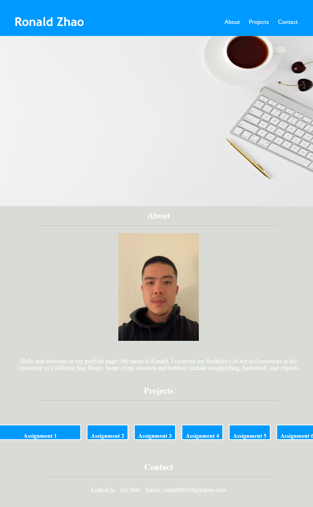

# Challenge-2

## Objective 
***
Create a website portfolio to showcase all future and current projects; Acceptance Criteria:  

-Presents developer's name, a recent photo or avatar, and links to sections about them, their work, and how to contact them.  

-Includes a working navigation bar that scrolls to the corresponding section the page when clicked.  

-Presents an assortment of projects with the first project image larger than the rest. 

-Presents a responsive layout that adapts to the various viewports.   

 

## Screenshot

## Links
https://ronzhao96.github.io/Challenge-2/